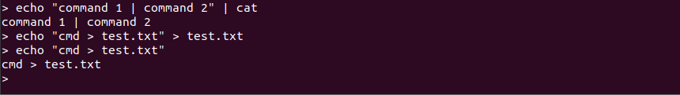

# klsh

A shell program imitating bash's behaviour, written with C++.

## Install dependencies

klsh use [the GNU Readline Library](https://tiswww.case.edu/php/chet/readline/rltop.html) to provide some basic command line features, e.g., command editing, history expansion, file names completion. To get insight into its user interface, you can read the [doc](https://tiswww.case.edu/php/chet/readline/rluserman.html).  klsh needs GNU Readline Library to compile and run. If you are on an Ubuntu machine, please type:

```shell
sudo apt install libreadline7 libreadline-dev
```

## Compile

You need g++ to compile: 

```shell
make
```

You will get an executable named `sh`, and that's it.

## Features

### Built-in commands

```cpp
const char *Cmd::builtins[] = {
    "exit",
    "export",
    "unset",
    "cd",
    "alias",
    "unalias"
};
```

> Why commands like `cd` have to be builtins?

Because every program has its own environments and status. Call `cd` in a child process will not change the directory of the parent process. And only the child will exit when you call `exit` in a child. Alias table is also built into the shell program. Aliasing in another program means nothing to your shell.

### Robustness

Most of string processing is done by using C++ Regex.  And I have spent some time on handling it's potential exception in a graceful way. You can trust it's robustness to some extent.

*I have considered using libexplain. But finally didn't use it in order to prevent bringing too many dependencies. So some of the error message may be not friendly enough.*

Some tests:


While receiving unexpected input, klsh tries its hard to be consistent with bash. In the tests above, however, when you type in invalid file descriptors or file names, the redirection will be ignored and the command will execute as normal with a warning thrown. 

The other features' tests below will show more robustness.

### Pipe

klsh supports piped command and n-piped command. Some tests:


When a command receives both redirection and pipe, the redirection will overwrite the pipe. This is also in consistency with bash. Some tests will be shown in [redirection](#Redirection) part.

### Redirection

Here are some basic redirections. You can also find klsh supports quoted string and variables: 


It doesn't matter to leave space or not between `>` and `filename`.

And this will show that redirections have higher priority than pipe:


And some redirections with file descriptors:


In the `\d+>&\d+` redirection, there should be no space between `>` and `& `(in consistency with bash). When the second file descriptor didn't show up in left hand side before this expression, it will be recognized as an invalid file descriptor:


This is also consistent with bash. But I only throw a warning while bash just aborts the command. Which is better? I don't know.

### Environment variables

Some tests:


Unset variables:


And I also support `$var` syntax:


#### Builtin variables

I also support some builtin variables: (from [bash scripting](http://linuxsig.org/files/bash_scripting.html))

> | *Variable* | *Use*                                                        |
> | ---------- | ------------------------------------------------------------ |
> | $#         | Stores the number of command-line arguments that were passed to the shell program. |
> | $?         | Stores the exit value of the last command that was executed. |
> | $0         | Stores the first word of the entered command (the name of the shell program). |
> | $*         | Stores all the arguments that were entered on the command line ($1 $2 ...). |
> | "$@"       | Stores all the arguments that were entered on the command line, individually quoted ("$1" "$2" ...). |


I don't differentiate between `$*` and `$@`.

### Quotation

I support quotation to combine multiple words into one word, and I support variables in double quoted strings. In the single quoted string, however, variables will not be recognized:


And below is one of the robustness of klsh: pipe character `|` and redirect characters `>`, `<` will not be recognized if quoted:



### Cd

Just view the tests below:


It supports `-`, `~`, `<space>`, `~username`.

### Alias

I have used `ll` above. That's an aliasing I added when the program was initialized. You can add your own aliasings. klsh also supports recursive aliasing.


And unalias:


### Completion & history

These are supported by GNU Readline.

### More features

klsh is extensible and more features can be added with ease.
